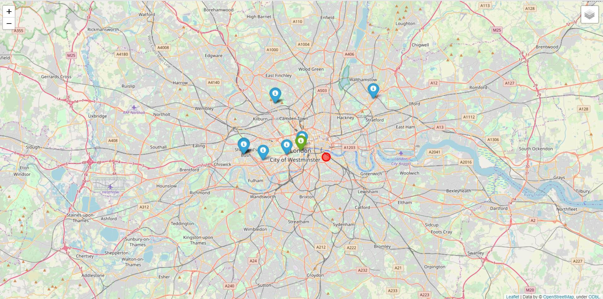
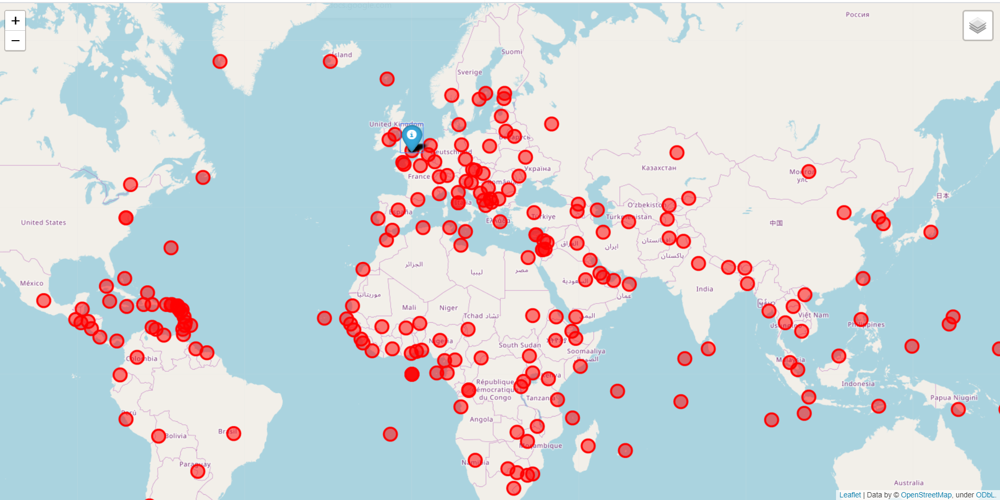

# Film_locations
Film_locations.py is a module, which provides you map with markers at the closest 
locations, where movies were filmed in a given year. Also capitals of all 
countries are marked on this map. 
# Description of HTML-file
As a result of using module, user gets HTML-file.
HTML-file is structured with the help of tags. Tag <'head'> contains information
about this file. Tag <'meta'> (which is inside of <'head'>) provides the
HTTP header for the information of the content attribute, 
specifies the character encoding for the HTML document
and sets the width of the page and initial zoom-level. Tag <script> points to an
external script file through the src attribute. Tag <style> defines style 
information for the document. Tag <'link'> is used to link to external style sheets.
Tag <'body'> contains all contents (map, markers), which are shown to user.
Tag <'div'> with attribute 'class' define equal styles for elements with the same
class name.

# Conclusion
With this map you always can find the closest locations of filming.
Your location is shown by green marker, and locations of filming - by
blue markers. Red circles show capitals of all countries.
# Example
Please, enter coordinates in range from 0 to 90 for northern and eastern hemisperes,
and from -90 to 0 for southern and western hemispheres.
```python
>>>python film_locations.py
Please enter a year you would like to have a map for:1930
Please enter latitude of your location 51.5074
Please enter longitude of your location -0.1278
Please wait, map is generating....

You can see map at map_with_films.html
```
What you see when you open the map_with_films.html

Whole map

